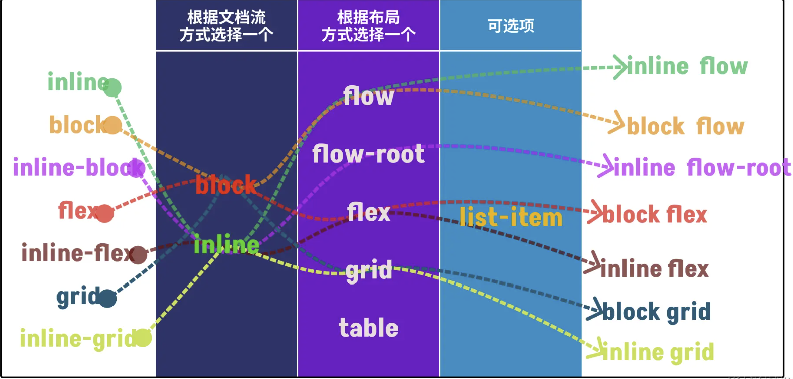

# 视觉盒模型

## 1、什么是视觉盒模型

视觉盒模型也被称为**视觉格式化模型**，根据 `CSS` 盒模型将 `HTML` 文档中的元素转换为一个个盒子。

它会根据盒子的包含块（`Container Block`）的边界来渲染盒子。它也是我们常说的格式化上下文（`Formatting Context`），比如大家常听到的 `BFC`、`IFC` 等。

在 CSS 中任何一个盒子就有了两种模型，其中一个是**盒模型（Box Model）** ，另一个就是**视觉盒模型（Visual Formatting Model）**。

## 2、与盒模型的对比

* **盒模型**：用来计算盒子的大小，包括了 CSS 的 `width` 、`height` 、`border` 、`padding` 和 `margin`；
* **视觉盒模型**：用来计算盒子位置，即用于布局。它主要由盒子的尺寸、盒子的类型、定位方案、文档树中的其它元素、浏览器视窗尺寸与位置、所包含的图片尺寸、其他的某些外部因素来决定。

## 3、合理的视觉盒模型作用

1. 合理的视觉盒模型会增加代码语义化；
2. 合理的视觉盒模型会减少冗余代码；

## 4、改变视觉盒模型

视觉盒模型会将 HTML 文档中的标签元素变成一个盒子，而且盒子有着不同类型。

可以通过 `display` 属性来手动调整盒子类型（视觉盒模型）


| **`display`** **的简写** | **`display`** **全称**  | **生成的盒子**                                               |
| ------------------------ | ----------------------- | ------------------------------------------------------------ |
| `none`                   |                         | 从盒子树中移除，包括其所有后代元素                           |
| `contents`               |                         | 元素替换为盒子树中的内容                                     |
| `block`                  | `block flow`            | 正常流内的块级盒子                                           |
| `flow-root`              | `block flow-root`       | 定义一个 BFC 的块级盒子                                      |
| `inline`                 | `inline flow`           | 正常流内的内联级盒子                                         |
| `inline-block`           | `inline flow-root`      | 定义一个内联块级盒子，又称内联块                             |
| `run-in`                 | `run-in flow`           | 定义一个 run-in 盒子（具有特殊的盒子树修改规则的内联级盒子） |
| `list-item`              | `block flow list-item`  | 正常文档流和带有附加标记的块级盒子                           |
| `inline list-item`       | `inline flow list-item` | 正常文档流和带有附加标记的内联级盒子                         |
| `flex`                   | `block flex`            | 带有内部伸缩布局的块级盒子（块级伸缩容器）                   |
| `inline-flex`            | `inline flex`           | 带有内部伸缩布局的内联级盒子（内联级伸缩容器）               |
| `grid`                   | `block grid`            | 带有内部网格布局的块级盒子（块级网格容器）                   |
| `inline-grid`            | `inline grid`           | 带有内部网格布局的内联级盒子（内联级网格容器）               |
| `ruby`                   | `inline ruby`           | 内联级 ruby 容器                                             |
| `block ruby`             | `block ruby`            | 块级 ruby 容器                                               |
| `table`                  | `block table`           | 带有内部表格布局的块级盒子                                   |
| `inline-table`           | `inline table`          | 带有内部表格布局的内联级盒子                                 |

表格中第一列是目前 `display` 的使用语法，第二列是 `display` 属性未来的使用语法，也被称为双值语法:

```css
.container {
    display: grid;
  
    /* 等同于 */
    display: block grid; /* 两个词之间有一个空格 */
}

.container {
    display: inline-grid;
  
    /* 等同于 */
    display: inline grid; /* 两个词之间有一个空格 */
}

```

新语法的选择方式：




这样做（`display` 设置双值）能更好地帮助理解更改 `display` 属性值时会发生什么。因为，在 CSS 中定义一个盒子的布局时，是在定义这个盒子发生了什么，它又是如何与布局中的其他盒子产生关系的。还定义了该盒子的所有子元素的行为。
