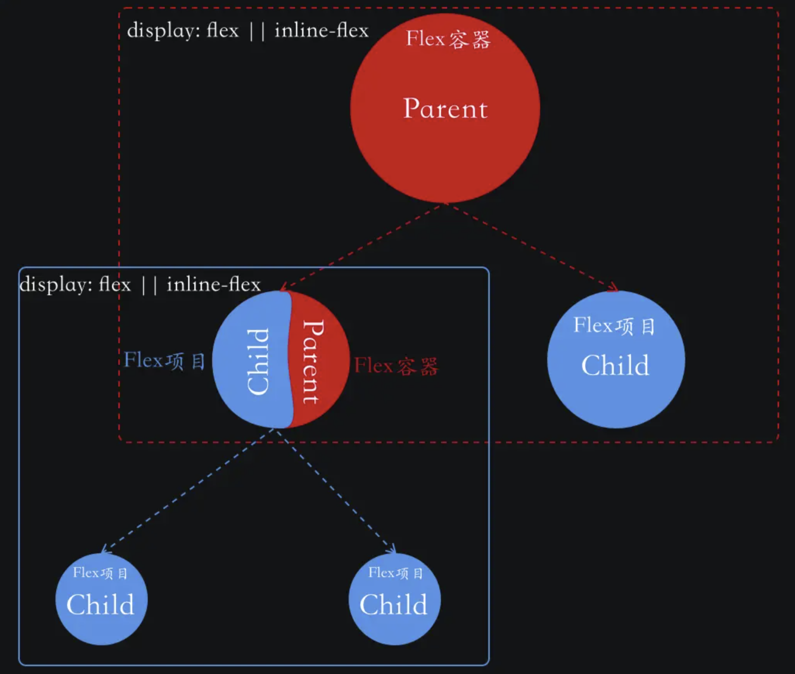
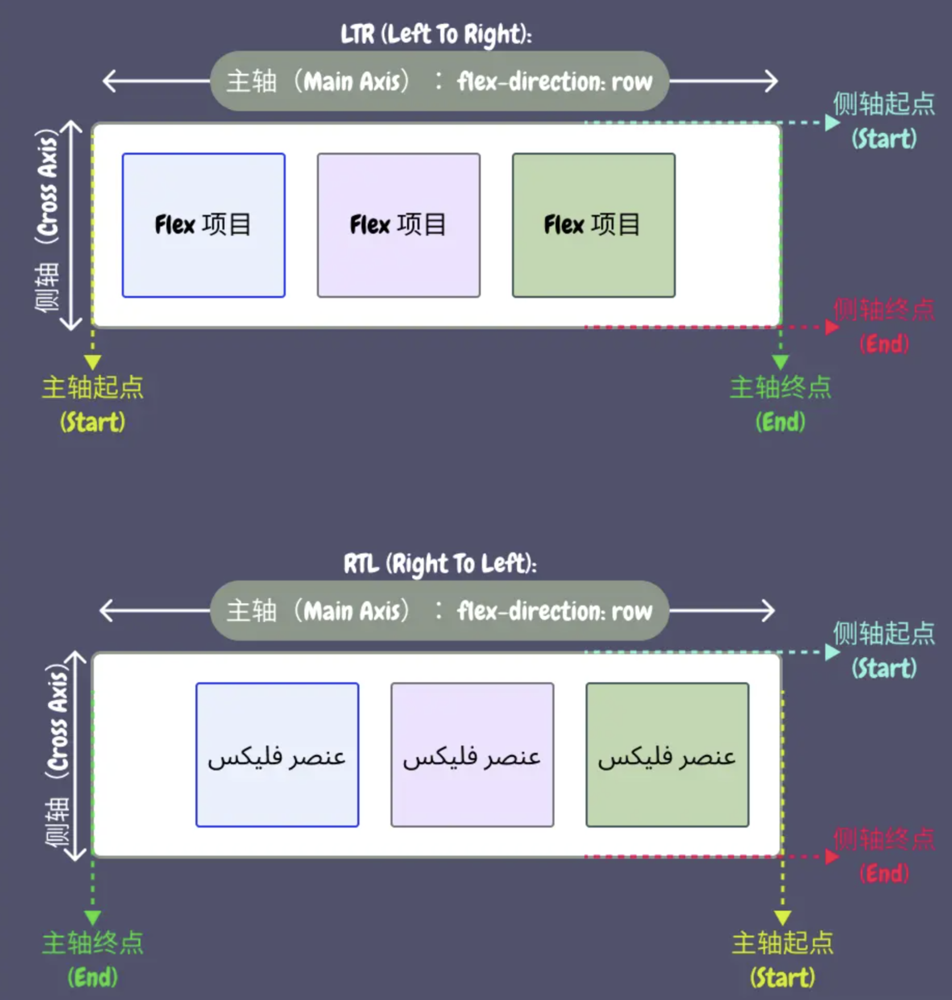
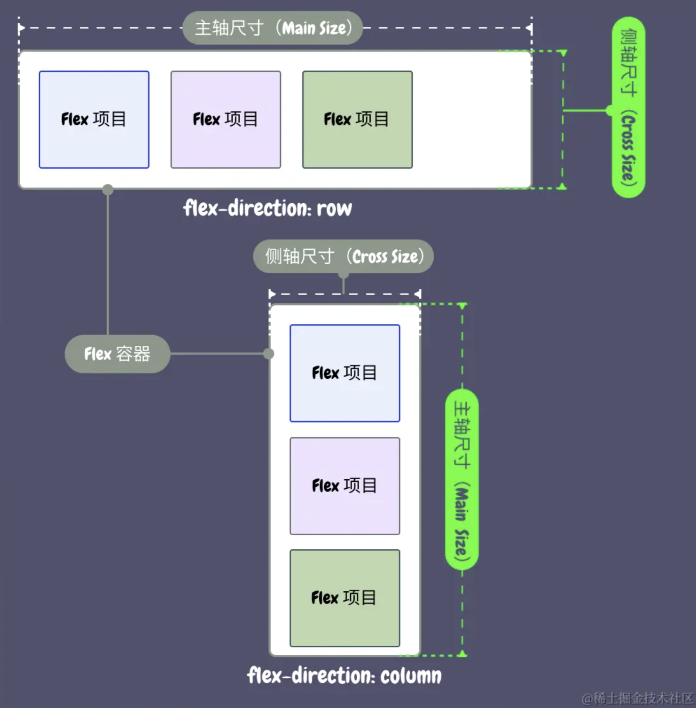
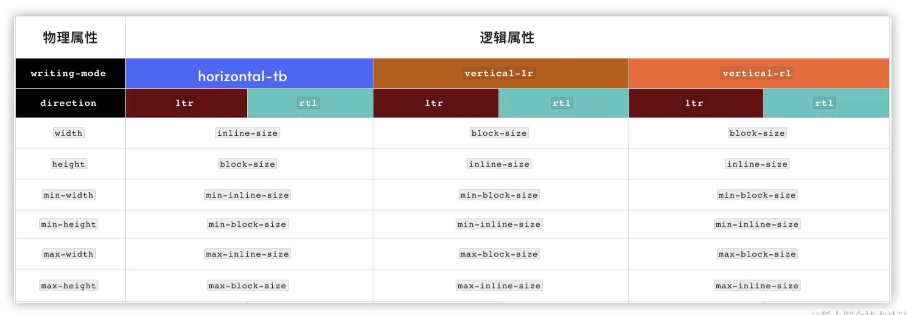

# Flexbox布局

## 1、Flexbox的简介

**Flexbox 布局 是一种布局机制，用于在一个维度上为项目组设置布局**

Flexbox 布局可以明确地指明容器空间的分布方式、内容对齐和元素的视觉顺序。

**使用 Flexbox 布局可以轻易地构建你想要的任何布局**。

需要注意的是：使用 Flexbox 布局还可以让 Web 内容的渲染不再受 HTML 文档源码顺序的限制。但这只是视觉上的调整，Flexbox 模块中的相关属性并不会改变屏幕阅读器对内容的读取顺序。

## 2、术语和概念

### 2.1、 **Flex** **容器** （也常称为 **Flexbox** **容器** ）

HTML 上的大多数元素都可以是 Flex 容器，比如 `div` 、`ul` 、`main` 块元素，`span` 、`em` 这样的内联元素。只需要在 HTML 元素上显式设置 `display` 的值为 `flex` 或 `inline-flex` 即可。

**但是 HTML 中的可替代元素是无法成为 Flex 容器的，比如`img`、 `input`、 `select`等元素**

当一个元素变成了 Flex 容器之后，它的子元素，包括其伪元素 `::before` 、`::after` 和 文本节点 都将成为 **Flex 项目** 。

**在 Flexbox 布局中， Flex 容器和 Flex 项目之间的关系永远是父子关系。**

因此，Flex 项目也可以是它的子元素的 Flex 容器，即 显式地在 Flex 项目设置 `display` 属性值为 `flex` 或 `inline-flex` ，该 Flex 项目就成为一个 Flex 容器，而它的子元素就成为 Flex 项目。

但它将是一个单独的 Flex 容器，它不会继承祖辈的 Flex 容器上的属性（Flexbox属性）。



### 2.2、轴

在 Flexbox 中，Flex 容器内也有两个轴，而且这两个轴只存在于 Flex 容器中，分别叫 **主轴** （Main Axis）和 **侧轴** （Cross Axis）。

Flexbox 中的主轴由 `flex-direction` 属性设置，默认情况下，主轴沿行方向（内联轴 Inline Axis）分布，如果该属性为 `column` ，则主轴沿列方向（块轴 Block Axis）分布。

Flexbox 布局中的主轴、主方向、侧轴和侧方向不是固定不变的，它们会随着`writing-mode`（书写模式）和 `direction`（阅读方向）而改变。

也就是说，Flex 项目在 Flex 容器中的排列方向同时会受 `flex-direction` 属性和 CSS 的书写模式 `writing-mode` 或 阅读模式 `direction` 影响。

在 Flexbox 布局中，不管是主轴还是侧轴，都有方向性。既然有方向，就有开始处（即起点）和结束处（即终点）之分。

根据起点和终点之分，Flex 容器中的每根轴又有 **主轴起点** 、**主轴终点** 、**侧轴起点** 和 **侧轴终点** 之分。而且每根轴的起点和终点是由 `flex-direction` 和 `writing-mode` (或 `direction`) 来决定的。



### 2.3、轴尺寸

Flexbox 布局中的 Flex 容器 和 Flex 项目同样是元素，它们也有大小。不同的是，对于 Flex 容器而言，它有 **主轴尺寸** （Main Size）和 **侧轴尺寸** （Cross Size）之分。它们的差别是：

* **主轴尺寸** 是指主轴起点到终点之间的距离；
* **侧轴尺寸** 是指侧轴起点到终点之间的距离 。

主轴尺寸和侧轴尺寸可以用来决定一个 Flex 容器的大小。但它们并不完全等同于 Flex 容器的宽高（`width x height` ）。

是因为 `flex-direction` 和 `writing-mode` 或 `direction` 属性值不同时，用于描述 Flex 容器的物理属性 `width` 和 `height` 有可能会互换的：

* 当 `flex-direction` 为 `row` ，且书写模式和阅读模式是 LTR 时，主轴的尺寸对应的就是 Flex 容器的宽度，侧轴的尺寸对应的则是 Flex 容器的高度；
* 当 `flex-direction` 为 `column` ，且书写模式和阅读模式是 LTR 时，主轴的尺寸对应的就是 Flex 容器的高度，侧轴的尺寸对应的则是 Flex 容器的宽度。



可以在 Flex 容器上显式使用 CSS 的物理属性 `width` 和 `height` ，或使用 CSS 的逻辑属性 `inline-size` 和 `block-size` 设置 Flex 容器主轴和侧轴的尺寸 ，也可以使用 `min-*` 和 `max-*` 对 Flex 容器主轴和侧轴的尺寸加以限制。



如果没有显式给 Flex 容器设置尺寸，则会根据所有 Flex 项目的大小来决定，或根据 Flex 容器的父容器来决定。

> **注意，如果需要显式设置 Flex 容器尺寸的话，使用逻辑属性** **`inline-size`** **或** **`block-size`** **更符合多语言的 Web 布局！**


## Flex布局的换行

在容器元素上显式设置 `display` 属性的值为 `flex` 或 `inline-flex` ，其子元素（包括其伪元素 `::before` 和 `::after` 以及匿名元素）会自动沿着 Flex 容器的主轴方向排成一行（或列）。

造成 Flex 容器无法容纳所有的 Flex 项目的因素：

1. Web 内容的变多：原本设计稿模板提供的内容（Flex 项目）是三个，但服务端实际输出的内容可能比三个多；
2. 终端设备视窗变小：Web 页面会在不同的终端设备上呈现，当终端设备的浏览器视窗宽度变窄时，也会造成 Flex 容器没有足够的空间来容纳所有 Flex 项目；

**解决方案**：

**只需要在 Flexbox 容器上显式设置** **`flex-wrap`** **的值为** **`wrap`** **或** **`wrap-reverse`（其默认值为** **`nowrap`）**

```css
.flex-container {
  flex-warp: warp; // 在主轴行下面堆叠
  flex-warp: warp-reverse; // 在主轴行上面堆叠
}
```

需要注意是：**`flex-wrap: wrap`** **(或** **`flex-wrap: wrap-reverse`)只有在 Flex 容器没有足够空间容纳 Flex 项目时（即，同一 Flex 行所有 Flex 项目最小内容宽度总和大于 Flex 容器宽度），才会让 Flex 项目换行（或列）**

资料来源：https://juejin.cn/book/7161370789680250917/section/7161621092560273439
