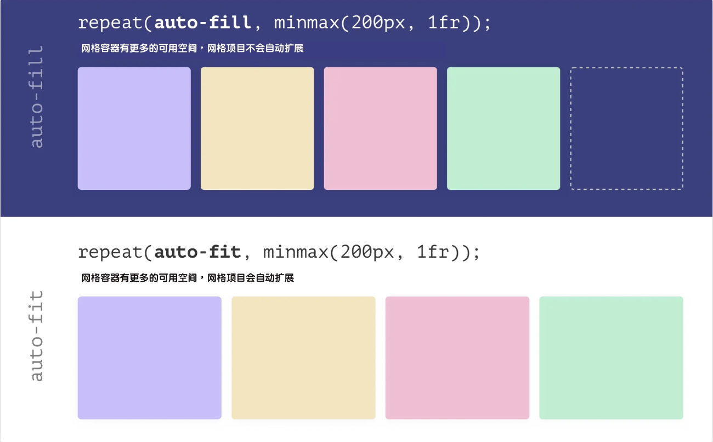

# Grid布局的换行

这里主要介绍 CSS Grid 布局中的 RAM 布局方案

> **RAM 布局技术指的是在定义网格时，使用了** **`repeat()`** **和** **`minmax()`** **函数，并且在** **`repeat()`** **函数中使用** **`auto-fit`** **或** **`auto-fill`** **关键词来指定网格轨道数量**：

```css
.cards {
    display: grid;
    grid-template-columns: repeat(auto-fit, minmax(300px, 1fr));
    gap: 1rem;
}

```

## `repeat()` 和 `minmax()` 函数

网格轨道的尺寸相同时可以使用 `repeat()` 函数来定义

```css
.grid {
    display: grid;
    grid-template-columns: 1fr 1fr 1fr;
  
    /* 等同于 */
    grid-template-columns: repeat(3, 1fr);
}

```

`minmax()` 可以给网格轨道尺寸指定一个 `MIN ~ MAX` 之间的区间值

```css
.grid {
    grid-template-columns: repeat(3, minmax(300px, 1fr));
}

```

> `fr` 是一个 CSS 单位，只可以用于 CSS Grid 中，将 `fr` 单位值和 `minmax()` 函数结合在一起定义网格轨道尺寸时是自动的 ，即**网格轨道尺寸是自动匹配的（在一个范围内）**

## **`auto-fit`** 和 **`auto-fill`**

在 `repeat()` 函数中使用 `auto-fill` 或 `auto-fit` 关键词来替代具体的数值。它们会告诉浏览器处理网格轨道的大小和断行（或断列），以便当容器空间不足以容纳元素时，元素会自动换行（或列）而不会造成溢出。



* `auto-fill` ：当使用 `minmax()` 函数时，`auto-fill` 在不改变网格项目宽度的情况下保留可用空间；

* `auto-fit` ：当使用 `minmax()` 函数时，`auto-fit` 关键词将扩展网格项目来填充可用空间。


## 问题点与解决方案：

当浏览器视窗的宽度小于 `minmax(MIN, MAX)` 中的 `MIN` 值时，浏览器就会出现水平滚动条或溢出内容被裁剪

只需要在 `minmax(MIN, MAX)` 函数中嵌套 CSS 的比较函数（`min()` 、`max()` 、`clamp()`），可以让该布局更为完美。

```css
.grid {
    grid-template-columns: repeat(auto-fit, minmax(min(100%, 300px), 1fr));
}

```
