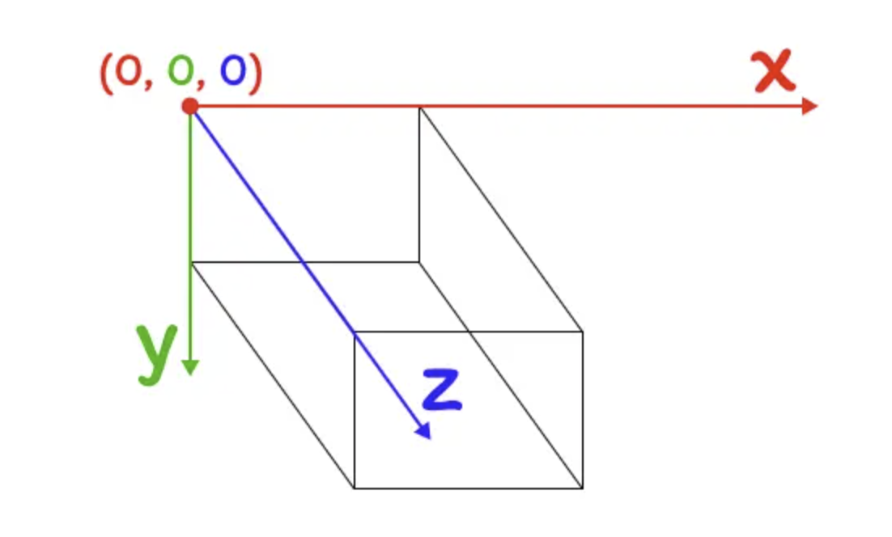
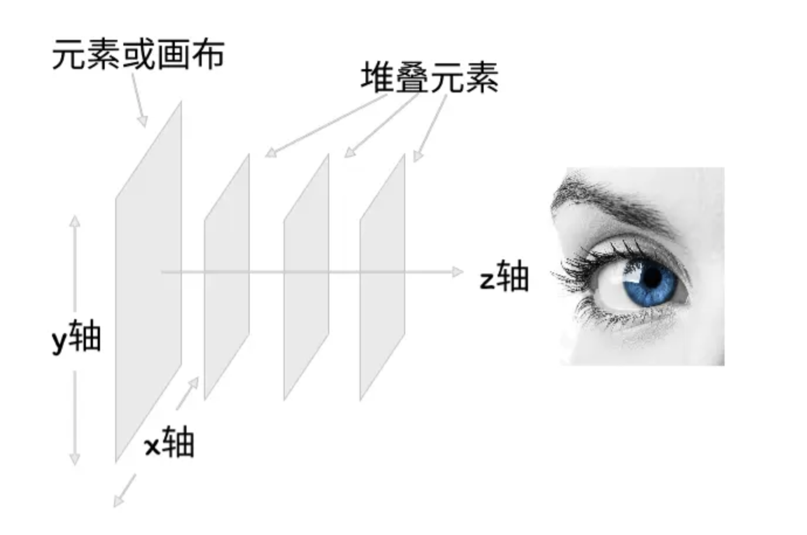
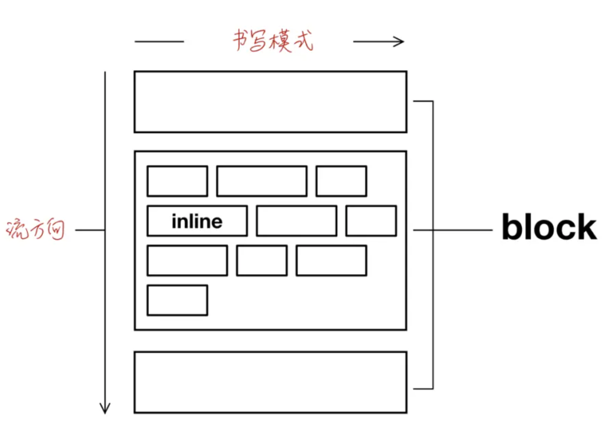
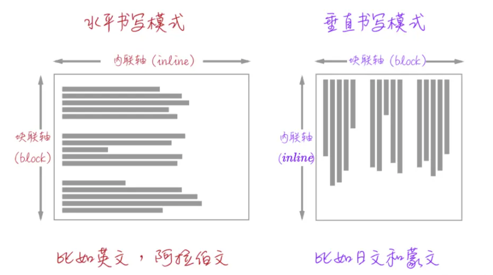

# CSS坐标系统

在 Web 中，默认原点是给定上下文的左上角，也就是元素盒子的左上角，它分为 `x` 轴（也称为水平轴），向右为正值，向左为负值；`y` 轴（垂直轴），向上为负值，向下为正值

除此之外还有控制第三维度的 `z` 轴。比如使用 CSS 的 `transform` 绘制 3D 图形或使用第三维度从前往后对对象进行分层

也会在定位元素（显式使用`position` 属性值为非 `static` 的元素）上使用 `z-index` 控制其层叠的顺序（`z` 轴上的层叠顺序），它表示的是用户与屏幕的这条看不见的垂直线：

随着 CSS 的逻辑属性出现，CSS 的坐标系也随之改变。它分为 **内联轴** （Inline Axis）和 **块轴** （Block Axis）

默认情况之下，每个元素都是一个盒子，盒子会根据元素类型分为块盒子（比如块元素 `div` ）和 内联盒子（比如`span`）

块盒会在垂直方向从上往下堆叠，内联盒子将会按照书写方式从左往右排列

当书写方式改变时，块盒子和内联盒子也会有相应的变化

也就是说：**块元素遵循流方向，内联元素遵循写入方向**

因此随着 CSS 的逻辑属性的出现，CSS 的坐标系就不再以 `x` 轴 和 `y` 轴来定义，而是以 **内联** （Inline）和 **块** （Block）来区分，并且内联方向的称之为 **内联轴** （Inline Axis），也就是书写模式的方向；块方向的称之为 **块轴** （Block Axis），也就是块盒子自然流的方向

## 总结

| 物理属性 | 逻辑属性(horizontal-tb) | 逻辑属性(vertical-lr) | 逻辑属性(vertical-rl) |
| -------- | ----------------------- | --------------------- | --------------------- |
| x 轴（水平轴） | Inline 轴（内联轴） | Block 轴（块轴） | Block 轴（块轴） |  |  |  |  |  |  |  |  |  |
| y 轴（垂直轴） | Block 轴（块轴） | Inline 轴（内联轴） | Inline 轴（内联轴） |  |  |  |  |  |  |  |  |  |  |  |  |  |  |

> 注意 ，不管是在物理坐标系还是逻辑坐标系中，z 轴是不变的！

参考资料：https://juejin.cn/book/7161370789680250917/section/7161621092665131022
